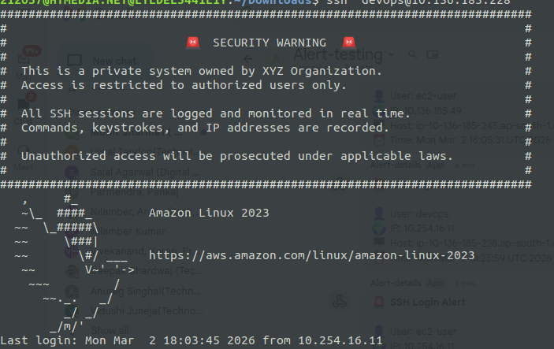
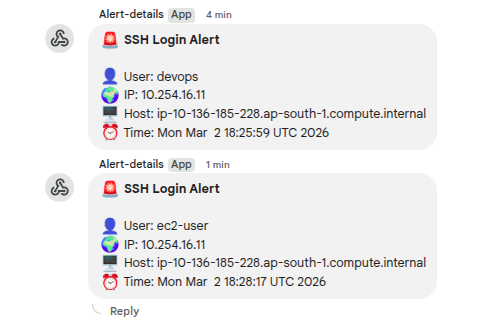
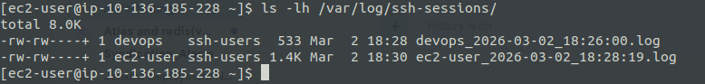
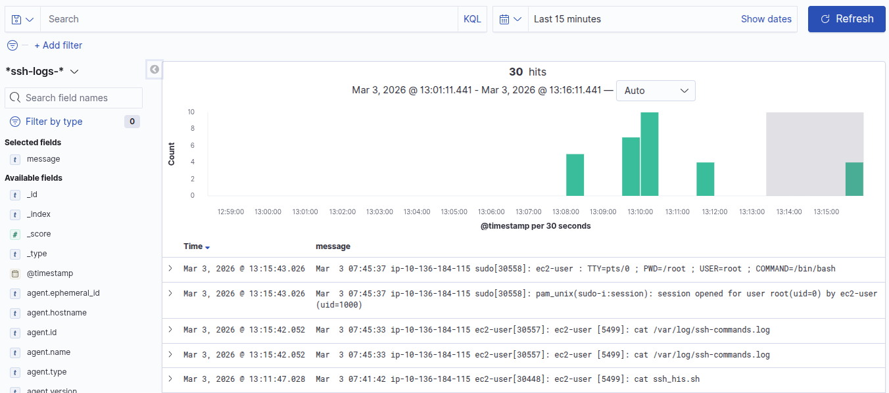
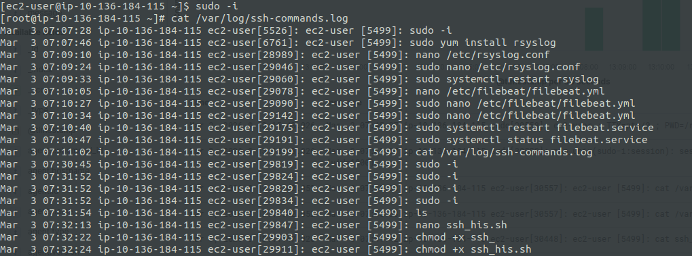

# Server Logging and Monitoring (SSH)

Automated SSH security hardening toolkit for Linux servers (Amazon Linux, RHEL/CentOS, Ubuntu/Debian). Two monitoring approaches, Google Chat login alerts, and deploy via shell scripts.

---

## Table of Contents

- [Two Approaches to SSH Session Monitoring](#two-approaches-to-ssh-session-monitoring)
  - [Approach 1 — Full Session Recording (CCTV Mode)](#approach-1--full-session-recording-cctv-mode)
  - [Approach 2 — Command History Only](#approach-2--command-history-only)
  - [Side-by-Side Comparison](#side-by-side-comparison)
- [Architecture Overview](#architecture-overview)
- [Repository Structure](#repository-structure)
- [Prerequisites](#prerequisites)
- [Quick Start](#quick-start)
  - [Option A — Shell Scripts](#option-a--shell-scripts)
- [Common Components (Both Approaches)](#common-components-both-approaches)
  - [SSH Warning Banner](#ssh-warning-banner)
  - [SSH Daemon Configuration](#ssh-daemon-configuration)
  - [Google Chat Login Alerts](#google-chat-login-alerts)
- [Approach 1 — Full Session Recording Setup](#approach-1--full-session-recording-setup)
  - [Session Recording Script](#session-recording-script)
  - [Shared Log-Directory Access](#shared-log-directory-access)
  - [Auditd Rules](#auditd-rules)
- [Approach 2 — Command History Setup](#approach-2--command-history-setup)
  - [Per-Command Logging via rsyslog](#per-command-logging-via-rsyslog)
  - [Filebeat → Elasticsearch Shipping](#filebeat--elasticsearch-shipping)
- [Verification](#verification)
- [Screenshots](#screenshots)
- [Optional Hardening](#optional-hardening)

---

## Two Approaches to SSH Session Monitoring

This toolkit provides **two distinct approaches** to SSH session monitoring. Choose the one that fits your use case, or use both together for defense-in-depth.

---

### Approach 1 — Full Session Recording (CCTV Mode)

> **Script:** `scripts/setup_ssh_monitoring.sh`

Records **everything** on the terminal — every keystroke, command output, interactive programs, editor sessions — into per-user log files using the Linux `script` command. Think of it as a CCTV camera for your terminal.

**How it works:**

```
SSH Login → /etc/profile.d/session-record.sh
                │
                ├── exec script -q -f /var/log/ssh-sessions/<user>_<timestamp>.log
                │       (captures full PTY stream: input + output)
                │
                └── auditd rules track execve syscalls + config file changes
                        → /var/log/audit/audit.log
```

**✅ Pros:**

| # | Pro | Detail |
|---|---|---|
| 1 | **Complete forensic record** | Every character on screen is captured — commands, output, interactive editors, tab completions, error messages |
| 2 | **Tamper-resistant** | `exec script` runs before the user's shell; users cannot easily avoid logging |
| 3 | **Auditd integration** | Kernel-level syscall auditing catches command execution even outside the shell |
| 4 | **Replay capability** | Log files can be replayed with `scriptreplay` for incident investigation |
| 5 | **Shell-agnostic** | Works with bash, zsh, sh, fish — any shell, any user config |
| 6 | **No external dependencies** | Only needs `script` (util-linux) and `auditd` — no Elasticsearch required |

**❌ Cons:**

| # | Con | Detail |
|---|---|---|
| 1 | **High disk usage** | Full terminal output is stored (including `cat` of large files, build output, etc.) |
| 2 | **Noisy, unstructured logs** | Contains ANSI escape codes and control characters — hard to grep or parse |
| 3 | **No centralized shipping** | Logs stay as local files; shipping to SIEM requires additional tooling |
| 4 | **Privacy concerns** | Captures **everything** — passwords typed in prompts, sensitive data on screen |
| 5 | **Minor performance overhead** | `script` adds a PTY layer; minimal but nonzero |

**Best for:** Compliance-heavy environments, forensic investigation, regulatory audit trails where you need to prove *exactly* what happened on screen.

---

### Approach 2 — Command History Only

> **Script:** `scripts/setup_ssh_command_his.sh`

Captures **only the commands** each user executes — one structured log line per command — using `PROMPT_COMMAND` → `logger` → rsyslog → Filebeat → Elasticsearch.

**How it works:**

```
SSH Login → /etc/profile.d/session-record.sh
                │
                ├── PROMPT_COMMAND → logger -p local6.notice "<user> [<pid>]: <command>"
                │       │
                │       └── rsyslog → /var/log/ssh-commands.log
                │                          │
                │                     Filebeat → Elasticsearch
                │
                └── /var/log/secure (SSH auth logs) → Filebeat → Elasticsearch
```

**✅ Pros:**

| # | Pro | Detail |
|---|---|---|
| 1 | **Lightweight** | One log line per command — minimal disk and CPU overhead |
| 2 | **Structured & searchable** | Each entry has user, PID, timestamp, command — easy to grep, parse, index |
| 3 | **Centralized via Filebeat** | Logs ship to Elasticsearch automatically for alerting and dashboards |
| 4 | **Low storage** | Orders of magnitude less disk than full session recording |
| 5 | **Clean logs** | Plain text — no ANSI codes or terminal noise |
| 6 | **SIEM-ready** | Elasticsearch/Kibana-ready out of the box; easy to build alerts and dashboards |

**❌ Cons:**

| # | Con | Detail |
|---|---|---|
| 1 | **Incomplete picture** | Only captures command strings — not output, interactive sessions, or editor content |
| 2 | **Bypassable** | Users can `unset PROMPT_COMMAND`, use a subshell, or run `bash --norc` |
| 3 | **Bash-only** | `PROMPT_COMMAND` is a Bash feature; zsh/fish need different hooks |
| 4 | **No replay** | Cannot reconstruct what the user actually saw on screen |
| 5 | **Requires infrastructure** | Needs rsyslog + Filebeat + Elasticsearch for full benefit |

**Best for:** Day-to-day operational monitoring, searchable audit logs, environments where you need quick command lookups without the overhead of full recording.

---

### Side-by-Side Comparison

| Criteria | Approach 1 (CCTV) | Approach 2 (Command History) |
|---|---|---|
| **What is captured** | Full terminal I/O stream | Command strings only |
| **Log format** | Raw PTY output (binary-ish) | Structured syslog lines |
| **Disk usage** | 🔴 High | 🟢 Low |
| **Searchability** | 🔴 Difficult (raw stream) | 🟢 Easy (structured text) |
| **Centralized shipping** | 🟡 Requires extra setup | 🟢 Built-in (Filebeat → ES) |
| **Bypass resistance** | 🟢 Hard to bypass | 🔴 Can be bypassed |
| **Forensic completeness** | 🟢 Complete | 🔴 Partial |
| **Performance impact** | 🟡 Moderate (PTY layer) | 🟢 Minimal |
| **Shell compatibility** | 🟢 Any shell | 🟡 Bash only |
| **Setup complexity** | 🟢 Simple (script + auditd) | 🟡 Needs rsyslog + Filebeat + ES |
| **Infrastructure needed** | 🟢 None (local files) | 🟡 Elasticsearch cluster |
| **Script** | `setup_ssh_monitoring.sh` | `setup_ssh_command_his.sh` |

> **💡 Recommendation:** Use **both approaches together** for defense-in-depth — Approach 1 for forensic/compliance needs and Approach 2 for daily operational monitoring and alerting.

---

## Architecture Overview

```
┌──────────────┐     PAM hook      ┌──────────────────┐
│  SSH Login   │ ─────────────────▶ │  Google Chat      │
│  (sshd)      │                    │  Webhook Alert    │
└──────┬───────┘                    └──────────────────┘
       │
       ├── /etc/profile.d/session-record.sh
       │       │
       │       ├── Approach 1: exec script → /var/log/ssh-sessions/
       │       │                             (full terminal capture)
       │       │
       │       └── Approach 2: PROMPT_COMMAND → logger → rsyslog
       │                                       → /var/log/ssh-commands.log
       │
       ├── auditd ──▶ /var/log/audit/audit.log        ← Approach 1 only
       │
       └── rsyslog ──▶ /var/log/ssh-commands.log       ← Approach 2 only
                              │
                         Filebeat ──▶ Elasticsearch
```

---

## Repository Structure

```
.
├── README.md
├── Sample_Img/
│   ├── Alert_Gchat.png          # Google Chat alert notification
│   ├── command_his.png          # Command history in terminal
│   ├── command_his_log.png      # Command history log file output
│   ├── logs.png                 # Session log directory listing
│   └── warning-panel.png        # SSH login warning banner
(Approach 1)
└── scripts/
    ├── setup_ssh_monitoring.sh  # Approach 1 — Full session recording + auditd
    └── setup_ssh_command_his.sh # Approach 2 — Command history + rsyslog + Filebeat
```

---

## Prerequisites

- **OS**: Amazon Linux 2/2023, RHEL/CentOS 7+, Ubuntu 20.04+, Debian 11+
- **Access**: Root or `sudo` privileges
- **Services**: OpenSSH server installed and running
- **Packages** (installed automatically by the scripts):
  - **Approach 1**: `auditd`, `util-linux`, `acl`, `curl`
  - **Approach 2**: `rsyslog`, `filebeat`, `util-linux`, `curl`
- **Optional**: Google Chat incoming webhook URL for login alerts
- **Optional (Approach 2)**: Elasticsearch endpoint (default: `http://ES_IP:9200`)

---

## Quick Start

### Option A — Shell Scripts

**Approach 1 — Full Session Recording (CCTV):**

```bash
chmod +x scripts/setup_ssh_monitoring.sh
sudo bash scripts/setup_ssh_monitoring.sh \
  --webhook "https://chat.googleapis.com/v1/spaces/SPACE_ID/messages?key=KEY&token=TOKEN"
```

**Approach 2 — Command History Only:**

```bash
chmod +x scripts/setup_ssh_command_his.sh
sudo bash scripts/setup_ssh_command_his.sh \
  --webhook "https://chat.googleapis.com/v1/spaces/SPACE_ID/messages?key=KEY&token=TOKEN"
```

**Common flags:**

| Flag | Description |
|---|---|
| `--webhook <url>` | Google Chat webhook URL. Without this a placeholder is written. |
| `--disable-eic` | Skip EC2 Instance Connect `AuthorizedKeysCommand` configuration. |
| `--ssh-log-group <name>` | Shared group for `/var/log/ssh-sessions` (default: `ssh-users`). Approach 1 only. |
| `-h`, `--help` | Show usage help. |


## Common Components (Both Approaches)

### SSH Warning Banner

Both approaches deploy the same login banner to `/etc/issue.net`:

```bash
sudo cat <<'EOF' > /etc/issue.net
###########################################################################
#                                                                         #
#                         🚨  SECURITY WARNING  🚨                        #
#                                                                         #
#  This is a private system owned by XYZ Organization.                    #
#  Access is restricted to authorized users only.                         #
#                                                                         #
#  All SSH sessions are logged and monitored in real time.                #
#  Commands, keystrokes, and IP addresses are recorded.                   #
#                                                                         #
#  Unauthorized access will be prosecuted under applicable laws.          #
#                                                                         #
###########################################################################
EOF
```

> **Result:**
>
> 

### SSH Daemon Configuration

Add to `/etc/ssh/sshd_config`:

```text
Banner /etc/issue.net

# (Optional — for EC2 Instance Connect)
AuthorizedKeysCommand /opt/aws/bin/eic_run_authorized_keys %u %f
AuthorizedKeysCommandUser ec2-instance-connect
```

```bash
sudo systemctl restart sshd
```

### Google Chat Login Alerts

Both approaches use the same PAM-based alert mechanism:

```bash
sudo cat <<'EOF' > /usr/local/bin/ssh-login-alert.sh
#!/bin/bash
GOOGLE_CHAT_WEBHOOK="https://chat.googleapis.com/v1/spaces/REPLACE/messages?key=REPLACE&token=REPLACE"

USER="$PAM_USER"
IP="$PAM_RHOST"
HOST=$(hostname)
TIME=$(date)

text="🚨 *SSH Login Alert*

👤 User: $USER
🌍 IP: $IP
🖥 Host: $HOST
⏰ Time: $TIME"

curl -s -X POST "$GOOGLE_CHAT_WEBHOOK" \
  -H "Content-Type: application/json" \
  -d "{\"text\": \"$text\"}" \
  --connect-timeout 10 > /dev/null 2>&1
EOF

sudo chmod +x /usr/local/bin/ssh-login-alert.sh
```

Add PAM hook to `/etc/pam.d/sshd`:

```text
session optional pam_exec.so seteuid /usr/local/bin/ssh-login-alert.sh
```

> **Result:**
>
> 

---

## Approach 1 — Full Session Recording Setup

### Session Recording Script

```bash
sudo mkdir -p /var/log/ssh-sessions
sudo chmod 700 /var/log/ssh-sessions

sudo cat <<'EOF' > /etc/profile.d/session-record.sh
# Run only once per SSH login and only for interactive shells
if [ -n "$SSH_CONNECTION" ] && [ -z "$SESSION_RECORDING" ] && [ -t 1 ]; then
    export SESSION_RECORDING=1
    LOG_FILE="/var/log/ssh-sessions/${USER}_$(date +%F_%T).log"
    exec script -q -f "$LOG_FILE"
fi
EOF
sudo chmod +x /etc/profile.d/session-record.sh
```

> **Result — session log files:**
>
> 

### Shared Log-Directory Access

The script creates an `ssh-users` group, discovers all `/home/*` users, and configures ACLs:

```bash
# Automatic: the script handles this, but manually:
sudo groupadd -f ssh-users
sudo chown root:ssh-users /var/log/ssh-sessions
sudo chmod 2770 /var/log/ssh-sessions
sudo setfacl -m g:ssh-users:rwx /var/log/ssh-sessions
sudo setfacl -d -m g:ssh-users:rwX /var/log/ssh-sessions
```

### Auditd Rules

```bash
sudo dnf install -y audit   # or: sudo apt-get install -y auditd

sudo cat <<'EOF' > /etc/audit/rules.d/ssh.rules
-a always,exit -F arch=b64 -S execve -k ssh-monitor
-a always,exit -F arch=b32 -S execve -k ssh-monitor
-w /etc/ssh/sshd_config -p wa -k ssh_config_change
-w /etc/passwd -p wa -k user_change
-w /etc/sudoers -p wa -k sudo_change
EOF

sudo augenrules --load
sudo systemctl enable auditd
sudo systemctl restart auditd
```

---

## Approach 2 — Command History Setup

### Per-Command Logging via rsyslog

```bash
sudo cat <<'EOF' > /etc/profile.d/session-record.sh
# Log executed commands only (clean format)
if [ -n "$SSH_CONNECTION" ]; then
  export PROMPT_COMMAND='
    RET=$?;
    logger -p local6.notice "$(whoami) [$$]: $(history 1 | sed "s/^[ ]*[0-9]\+[ ]*//")"
  '
fi
EOF
sudo chmod +x /etc/profile.d/session-record.sh

# Route local6 facility to a dedicated log file
echo "local6.*    /var/log/ssh-commands.log" | sudo tee /etc/rsyslog.d/30-ssh-commands.conf
sudo systemctl restart rsyslog
```

> **Result — commands captured:**
>
> 

### Filebeat → Elasticsearch Shipping

The `setup_ssh_command_his.sh` script automatically adds the **Elastic 8.x repository** if Filebeat is not already installed:

- **Debian/Ubuntu**: imports GPG key → `/usr/share/keyrings/elastic-keyring.gpg`, adds APT source at `/etc/apt/sources.list.d/elastic-8.x.list`
- **RHEL/Amazon/CentOS**: `rpm --import` GPG key, writes YUM repo at `/etc/yum.repos.d/elastic-8.x.repo`

Filebeat configuration (`/etc/filebeat/filebeat.yml`):

```yaml
filebeat.inputs:
  - type: log
    paths:
      - /var/log/secure
    fields:
      log_type: ssh_auth
    fields_under_root: true

  - type: log
    paths:
      - /var/log/ssh-commands.log
    fields:
      log_type: ssh_command
    fields_under_root: true

output.elasticsearch:
  hosts: ["http://ES_IP:9200"]
  index: "%{[host.name]}-ssh-logs-%{+yyyy.MM.dd}"

setup.ilm.enabled: false
setup.template.enabled: false
```

> **Result — command history log shipped to Elasticsearch:**
>
> 

---

## Verification

### Approach 1 — Full Session Recording

```bash
# List session recordings
ls -lh /var/log/ssh-sessions/

# Check auditd rules are loaded
sudo auditctl -l

# View recent audit events
sudo ausearch -k ssh-monitor | tail

# Audit summary
sudo aureport -x --summary
```

### Approach 2 — Command History

```bash
# View command history log in real time
sudo tail -f /var/log/ssh-commands.log

# Check Filebeat status
sudo systemctl status filebeat

# Test Filebeat Elasticsearch connectivity
sudo filebeat test output
```

### Common (Both Approaches)

```bash
# Verify PAM hook is in place
grep ssh-login-alert /etc/pam.d/sshd

# Verify banner is configured
sudo sshd -T | grep -i banner

# Trigger a test login to verify Google Chat alert
ssh user@your-server
```

---

## Screenshots

### SSH Warning Banner


### Google Chat Login Alert


### Command History (terminal)


### Command History Log File


### Session Logs Directory


---

## Optional Hardening

```bash
# Make audit log append-only
sudo chattr +a /var/log/audit/audit.log

# Track dangerous commands
sudo auditctl -w /usr/bin/rm -p x -k dangerous
sudo auditctl -w /usr/bin/useradd -p x -k privilege_change
sudo auditctl -w /usr/bin/passwd -p x -k password_change

# Search tracked events
sudo ausearch -k dangerous
```
